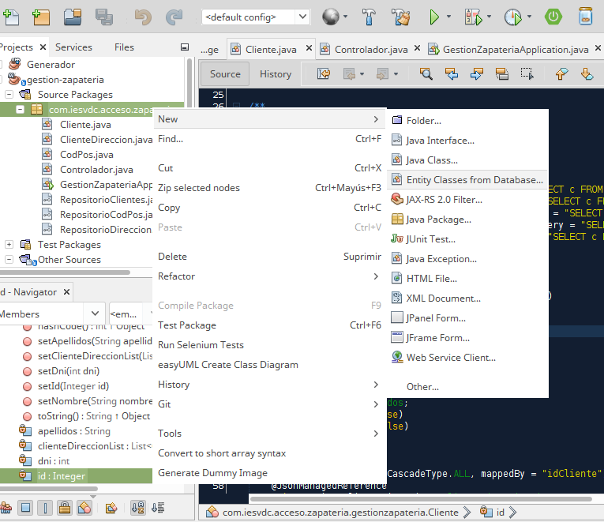
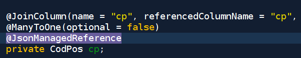

# Proyecto Zapateria

Ejercicio: implementar como servicio REST un CRUD con Spring contra una base
de datos MariaDB. 

Prueba de concepto para demostrar cómo crear con anotaciones @Autowiring
un servicio REST con Spring e Hibernate.

También veremos cómo solucionar el problema que el JSON generado sea 
recursivo (entidades que referencian a entidades).

## Paso 1: Crear la Base de Datos

Instalamos MySQL o MariaDB o bien usamos un contenedor docker.

Creamos la BBDD "zapateria".

## Paso 2: Conectar desde NetBeans o STS a la BBDD (crear la conexión)

Con Netbeans, pestaña "Servicios", botón derecho en "Databases" y creamos una 
nueva conexión. 

Si usamos MariaDB, tendremos que descargarnos el 
[Conector Java desde su Web](https://mariadb.com/kb/en/library/about-mariadb-connector-j/).

En cadena de conexión ponemos: **jdbc:mariadb://localhost:3306/database** para 
forzar el driver MariaDB.

Una vez conectados, creamos las tablas e introducimos los datos:

```sql
DROP TABLE IF EXISTS cliente_direccion;
DROP TABLE IF EXISTS cliente;
DROP TABLE IF EXISTS cod_pos;
--
-- TABLE: cod_pos
--
--
CREATE TABLE cod_pos (
  cp INT PRIMARY KEY,
  localidad VARCHAR(120) NOT NULL
);
--
-- TABLE: clientes
--
--
CREATE TABLE cliente (
  id INT AUTO_INCREMENT PRIMARY KEY,
  nombre VARCHAR(40) NOT NULL ,
  apellidos VARCHAR(100) NOT NULL ,
  dni INT NOT NULL
);
--
-- TABLE: cliente_direccion
--
--
CREATE TABLE cliente_direccion (
  id_direccion INT AUTO_INCREMENT PRIMARY KEY,
  nombre VARCHAR(100),
  id_cliente int REFERENCES cliente(id) ON UPDATE CASCADE ON DELETE CASCADE,
  nombre_via VARCHAR(150) NOT NULL ,
  cp int REFERENCES cod_pos(cp) ON UPDATE CASCADE ON DELETE SET NULL
);
INSERT INTO `cliente` (`id`, `nombre`, `apellidos`, `dni`) VALUES
(1, 'Pepe', 'Perez Martinez', 12345678),
(2, 'Miguel Angel', 'Gutierrez Garcia', 87654321)
(3, 'Juan', 'Sin Miedo', 11223344);
INSERT INTO `cod_pos` (`cp`, `localidad`) VALUES
(23005, 'Jaén'),
(23008, 'Jaén'),
(29000, 'Málaga');
INSERT INTO `cliente_direccion` (`nombre`, `id_direccion`, `id_cliente`, `nombre_via`, `cp`) VALUES
('Mi casa', 1, 1, 'Paseo de la Estación 44', 23008),
('Casa', 2, 2, 'Rue del Percebe 13', 23005),
('Playa', 3, 2, 'Rue del Percebe 13', 29000),
('Oficina', 1, 3, 'Avenida de Andalucia S/N', 29000);
```

### Paso 3: Creamos el proyecto

#### Usando este repo
Clonamos este repositorio y configuramos la conexión modificando
"src/main/resources/application.properties" con nuestro usuario y contraseña:

```java
spring.datasource.url = jdbc:mariadb://localhost:3306/database
spring.datasource.username = username
spring.datasource.password = password
spring.jpa.properties.hibernate.dialect = org.hibernate.dialect.MariaDBDialect
spring.jpa.hibernate.ddl-auto = update
```

#### Creando el proyecto desde cero: 

Visitar la página [Spring Initializr](start.spring.io) y creamos un proyecto.


### Paso 4: Generar las entidades nuevas desde la BBDD

Botón derecho en el proyecto, "new" -> "Entities from Database":



Tenemos que estar conectados a la base de datos para poder generar las clases entidad.

### Paso 5: Modificar las clases entidad para evitar referencias recursivas en JSON

Modificando la aplicación Spring: para conseguir que se genere JSON donde unas
entidades aniden a otras, tenemos que añadir **@EnableJpaRepositories(considerNestedRepositories = true)**
a nuestra aplicación.

```java
package com.iesvdc.acceso.zapateria.gestionzapateria;

import org.springframework.boot.SpringApplication;
import org.springframework.boot.autoconfigure.SpringBootApplication;
import org.springframework.data.jpa.repository.config.EnableJpaRepositories;

@EnableJpaRepositories(considerNestedRepositories = true)
@SpringBootApplication
public class GestionZapateriaApplication {

	public static void main(String[] args) {
		SpringApplication.run(GestionZapateriaApplication.class, args);
	}
}
```



### Paso 6: Crear las interfaces de los distintos repositorios

### Paso 7: Crear el controlador

### Paso 8: Probar el servicio

### Paso 9: Crear el cliente Web que conecte al servicio


